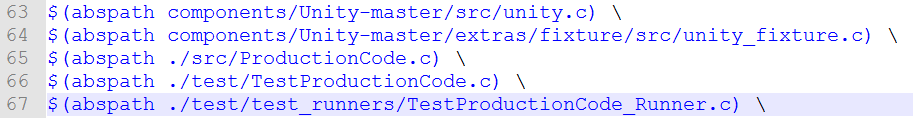
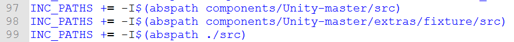

# nRF51_Unit_Testing
- This repository help you getting unit test result with Unity framwork from nRF51-DK board.
- This repository is modified from ble_app_uart_s110_pca10028.
- This repository contains test code which is not related with project working code. Only prove nRF51-DK can print test code result.

# Need
- nRF51-DK
- Serial terminal program, e.g., [Teraterm](http://download.cnet.com/Tera-Term/3000-20432_4-75766675.html)
- [GNU Tools ARM Embedded 4.9.3](https://launchpad.net/gcc-arm-embedded/4.9/4.9-2015-q3-update)
- [Make for Windows](http://gnuwin32.sourceforge.net/packages/make.htm) - Complete package, except sources
- [CoreUtils for Windows](http://gnuwin32.sourceforge.net/packages/coreutils.htm) - Complete package, except sources
- [nRFgo studio](https://www.nordicsemi.com/eng/Products/2.4GHz-RF/nRFgo-Studio)
- **reference this [link](https://devzone.nordicsemi.com/tutorials/7/) "Before we begin" section.


# 1. Download repository and unzip

# 2. Connect nRF51-DK

# 3. Run Teraterm and config UART
- baudrate : 38400
- data : 8 bit
- parity : none
- stopbit : 1 bit
- control-flow : hardware

# 4. Run CMD and Type Commands
```
$ cd nRF51_Unit_Testing
$ make all
$ make flash_softdevice
$ make flash nrf51422_xxac_s110
```
# 5. Check test code result from Teraterm

# 6. Result


###UART confg
..../nRF51_Unit_Testing/main.c
```C
/**@brief  Function for initializing the UART module.
 */
/**@snippet [UART Initialization] */
static void uart_init(void)
{
    uint32_t                     err_code;
    const app_uart_comm_params_t comm_params =
    {
        RX_PIN_NUMBER,
        TX_PIN_NUMBER,
        RTS_PIN_NUMBER,
        CTS_PIN_NUMBER,
        APP_UART_FLOW_CONTROL_ENABLED,
        false,
        UART_BAUDRATE_BAUDRATE_Baud38400
    };
    
    ....
}
/**@snippet [UART Initialization] */
```

###Terminal text color config
..../nRF51_Unit_Testing/components/Unity-master/src/unity.c
```C
void UnityPrint(const char* string)
{
    const char* pch = string;
    
	//Black : \33[30m, Red : \33[31m, Green : \33[32m, Yellow : \33[33m,
	//Blue : \33[34m, Magenta : \33[35m, Cyan : \33[36m, Whith : \33[37m
	//https://en.wikipedia.org/wiki/ANSI_escape_code#Colors
	if(0 == memcmp(pch, UnityStrFail, sizeof(UnityStrFail)) ||
	   0 == memcmp(pch, UnityStrResultsFailures, sizeof(UnityStrResultsFailures))) printf("\33[31m");
	else if(0 == memcmp(pch, UnityStrOk, sizeof(UnityStrOk)) ||
			  0 == memcmp(pch, UnityStrPass, sizeof(UnityStrPass))) printf("\33[32m");
	else if(0 == memcmp(pch, UnityStrIgnore, sizeof(UnityStrIgnore)) ||
			  0 == memcmp(pch, UnityStrResultsIgnored, sizeof(UnityStrResultsIgnored))) printf("\33[33m");

....
}
```

###Test result attribute
..../nRF51_Unit_Testing/components/Unity-master/extras/fixture/src/unity_fixture.c
```C
int UnityGetCommandLineOptions(int argc, const char* argv[])
{
    int i;
    UnityFixture.Verbose = 1; //0 : print only FAIL, IGNORE test result, 1 : print all test result
    UnityFixture.GroupFilter = 0;
    UnityFixture.NameFilter = 0;
    UnityFixture.RepeatCount = 1;
    
    return 0;

....
}
```

###Add Unity framework and test code to makefile
..../nRF51_Unit_Testing/Makefile


- Line 63-64 : Add Unity framework source
- Line 65-67 : Add test code source


- Line 97-98 : Add Unity framwork directory
- Line 99 : Add test code directory
